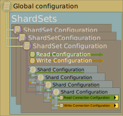

# The Hereditary Configuration Hierarchy

ArgentSea essentially dispenses with traditional connection strings. Instead, it uses the new .NET configuration architecture to manage each attribute as a discrete property. Each property can be managed globally, or at the shardSet, database, or connection level. Lower-level settings inherit values from their parent, which they can also overwrite if their own values are set differently.

The Hereditary Configuration Hierarchy allows users to configure their data connection information at multiple levels. Child nodes “inherit” any settings of their parent. By dramatically reducing configuration redundancy, it makes handling many connections much more manageable.

For example, if your network infrastructure supports jumbo frames, you can configure the network packet size *once*, in the global configuration section, and every ArgentSea connection will default to this value.

## The Global Section

The root of the configuration hierarchy is the “global settings” section. All properties set here are applied to every data connection — unless the value is overwritten by lower-level properties (i.e. database, shard set, shard, etc.).

## [SQL Server](#tab/tabid-sql)

The SQL Server global section is `SqlGlobalSettings`. Any attributes specified in this section are applied to all SQL Server connections.

For example, to globally change both the connection timeout property and packet size:

````json
{
  "SqlGlobalSettings": {
    "ConnectTimeout": 3,
    "PacketSize": 8196
  }
}
````

## [PostgreSQL](#tab/tabid-pg)

The PostgreSQL global section is `PgGlobalSettings`. Any attributes specified in this section are applied to all PostgreSQL connections.

For example, to globally change both the connection timeout property and packet size:

````json
{
  "PgGlobalSettings": {
    "Timeout": 3,
    "SocketReceiveBufferSize": 8192,
    "SocketSendBufferSize": 8192
  }
}
````

***

Note that these examples include only the attributes that we want to change. The complete attribute list is described below.

## (Non-Sharded) Database Connections

The database configuration architecture allow any number of database connections. Each connection is identified by a key, which you also use to request the connection in your code. The key in your configuration must *exactly* match the keys used in your code (i.e casing, accents, and kana must match — and spelling too).

Database connections have a three-level hierarchy: global properties, database properties, and properties for distinct read and write endpoints. This illustration shows how various “parent” configuration properties are applied to the child values. Ultimately, these values are combined to build a Read or Write connection.


The upshot is that if you have a simple database connection that handles both reads and writes, you can define this once at the database level; both Read and Write connections will “inherit” this value.

## [SQL Server](#tab/tabid-sql)

The JSON section for SQL database connections is `SqlDbConnections`. This is an array of connections. Each connection has a required `DatabaseKey` property, and whatever connection properties are needed for the connection.

````json
{
  "SqlDbConnections": [
    {
      "DatabaseKey": "MainDb",
      "DataSource": "DbServer1",
      "InitialCatalog": "MainDb",
      "WindowsAuth": true
    },
    {
      "DatabaseKey": "OtherDb",
      "DataSource": "DbServer1",
      "InitialCatalog": "OtherDb",
      "WindowsAuth": true,
      "WriteConnection": {
        "DataSource": "DbServer2"
      }
    },
    {
      "DatabaseKey": "ThirdDb",
      "ReadConnection": {
        "DataSource": "DbServer3",
        "InitialCatalog": "Db1",
        "UserName": "apiUser",
        "Password": "pwd1234"
      },
      "WriteConnection": {
        "DataSource": "DbServer4",
        "InitialCatalog": "Db2",
        "UserName": "webUser",
        "Password": "pwd5678"
      }
    }
  ]
}
````

## [PostgreSQL](#tab/tabid-pg)

The JSON section for PostgreSQL database connections is `PgDbConnections`. This is an array of connections. Each connection has a required `DatabaseKey` property, and whatever connection properties are needed for the connection. The application obtains a connection by this `DatabaseKey` and the characters must be an exact match.

````json
  "PgDbConnections": [
    {
      "DatabaseKey": "MainDb",
      "Host": "10.10.25.1",
      "Database": "MainDb",
      "WindowsAuth": true
    },
    {
      "DatabaseKey": "OtherDb",
      "Host": "10.10.25.2",
      "Database": "OtherDb",
      "WindowsAuth": true,
      "WriteConnection": {
        "Host": "10.10.25.2"
      }
    },
    {
      "DatabaseKey": "ThirdDb",
      "ReadConnection": {
        "Host": "10.10.25.4",
        "Database": "MainDb",
        "UserName": "apiUser",
        "Password": "pwd1234"
      },
      "WriteConnection": {
        "Host": "10.10.20.25",
        "Database": "MainDb",
        "UserName": "webUser",
        "Password": "pwd5678"
      }
    }
  ]
}
````

***

Each connection has two optional child sections, `ReadConnection` and `WriteConnection`. These can be set explicitly if you want different values between read and write connections; otherwise, both read and write connections these will inherit from the parent properties.

In the example above, the first connection has the same values for read and write connections (both Read and Write connections inherit the same values from the parent). The second connection will access a different server for read connections than write connections. The third connection explicitly defines connection information for both the Read and Write connections.

As mentioned before, *any* connection property from the complete property list (as listed earlier), can be included in the database definition, read connection, or write connection.

## Shard Set Connections

ArgentSea shard sets have up to five inheritance levels: global properties, shard set properties, shard set read/write properties, shard properties, and distinct read and write endpoint properties. The corresponding illustration again shows how various “parent” configuration properties are applied to the child values. As with non-sharded databases, these values are combined to build a Read or Write connection.

When using a scale-out read strategy, all or most of your read connections might have consistent values (a login, for example), which could likely be different than the consistent values used for all of your write connections. A straightforward parent-child inheritance would require you to redundantly specify the same values for every shard’s read or write connection. To better manage this, the ShardSet has an exception to the parent-child hierarchy: a Read and Write configuration section. Values set in the ShardSet Read section will be used by only the read connections in the shards within the set. Likewise, write connections in the shard set inherit from the write parameters.



## [SQL Server](#tab/tabid-sql)

The root JSON section for SQL shard connections is `SqlShardSets`. This is an array of shard sets, each of which has an array of shards. Presumably, most applications will not require multiple shard sets, but the capability exists if required.

Each shard set has a required `ShardSetName` property. This is how the shard set retrieved from within the application, so the characters must *exactly* match.

In addition, a shard set can include a `DefaultShardId` value, which may be used to determine which shard should be used when this client creates new records.

````json
{
  "SqlShardSets": [
    {
      "ShardSetName": "Primary",
      "DefaultShardId": 1,
      "UserName": "webUser",
      "Password": "pwd1234",
      "Read": {
        "ApplicationIntent": "ReadOnly",
        "UserName": "webReader"
      },
      "Shards": [
        {
          "ShardId": 0,
          "DataSource": "DbServer1",
          "FailoverPartner": "Mirror1",
          "InitialCatalog": "ShardDb1",
          "ReadConnection": {
            "DataSource": "Mirror1",
          }
        },
        {
          "ShardId": 1,
          "DataSource": "DbServer2",
          "FailoverPartner": "Mirror2",
          "InitialCatalog": "ShardDb2",
          "ReadConnection": {
            "DataSource": "Mirror2",
          }
        }
      ]
    }
  ]
}
````

In this example, there is one shard set with two shards as two databases on the same server. The read connections are directed to a mirror by overwriting the inherited `DataSource` value with the name of the mirror. Of course, in reality the password should be moved to a different, more secure configuration provider.

## [PostgreSQL](#tab/tabid-pg)

The root JSON section for SQL shard connections is `PgShardSets`. This is an array of shard sets, each of which has an array of shards. Presumably, most applications will not require multiple shard sets, but the capability exists if required.

Each shard set has two required properties:

* The `ShardSetName` property is how the shard set retrieved from within the application, so the characters must *exactly* match.
* The `DefaultShardId` value can be used to determine which shard should be used when this client creates new records.

````json
{
  "PgShardSets": [
    {
      "ShardSetName": "Primary",
      "DefaultShardId": 1,
      "Host": "DbServer1",
      "UserName": "webUser",
      "Password": "pwd1234",
      "Read": {
        "UserName": "webReader"
      },
      "Shards": [
        {
          "ShardId": 0,
          "Database": "ShardDb1",
          "ReadConnection": {
            "DataSource": "HotStandby1",
          }
        },
        {
          "ShardId": 1,
          "Database": "ShardDb2",
          "ReadConnection": {
            "DataSource": "HotStandby1",
          }
        }
      ]
    }
  ]
}
````

In this example, there is one shard set with two shards as two databases on the same server. The read connections are directed to a hot standby replication instance by overwriting the inherited `DataSource` value with the name of the mirror. Of course, in reality the password should be moved to a different, more secure configuration provider.

***

Again, *any* connection property from the complete property list — as enumerated in the next section — can be included in the shard set definition (to be used by all connections in the shard set), or shard instance (to be used by both Read and Write connections), or to specifically configure the Read and/or Write connection.

In a typical data sharding implementation, all shard read or write connections are likely to use same login information. Each server may even use the same database name. The Hereditary Configuration Hierarchy makes this easy to manage because the login information and database can be defined once for the shard set, or shard set read/write connection type, then used by every connection.

## Connection Attributes

The complete set of available properties is:

## [SQL Server](#tab/tabid-sql)

````json
{
  "ApplicationIntent": "ReadWrite",
  "ApplicationName": "MyWebApp",
  "CircuitBreakerFailureCount": 20,
  "CircuitBreakerTestInterval": 5000,
  "ConnectTimeout": 2,
  "CurrentLanguage": "english",
  "DataSource": "localhost",
  "Encrypt": false,
  "FailoverPartner": "MyMirror",
  "InitialCatalog": "MyDb",
  "LoadBalanceTimeout": 0,
  "MaxPoolSize": 100,
  "MinPoolSize": 0,
  "MultipleActiveResultSets": false,
  "MultiSubnetFailover": true,
  "PacketSize": 4096,
  "Password": "pwd1234",
  "PersistSecurityInfo": false,
  "Pooling": true,
  "Replication": true,
  "RetryCount": 6,
  "RetryInterval": 256,
  "RetryLengthening": "Fibonacci",
  "TransactionBinding": "",
  "TrustServerCertificate": true,
  "TypeSystemVersion": "Latest",
  "UserInstance": "",
  "UserName": "webUser",
  "WindowsAuth": false,
  "WorkstationID": "MyPC"
}
````

## [PostgreSQL](#tab/tabid-pg)

````json
{
  "ApplicationName": "MyWebApp",
  "AutoPrepareMinUsages": 5,
  "CheckCertificateRevocation": false,
  "CircuitBreakerFailureCount": 20,
  "CircuitBreakerTestInterval": 25,
  "ClientEncoding": "UTF8",
  "CommandTimeout": 5,
  "ConnectionIdleLifetime": 300,
  "ConnectionPruningInterval": 10,
  "ConvertInfinityDateTime": false,
  "Database": "MyDb",
  "Encoding": "UTF8",
  "Enlist": true,
  "Host": "10.10.25.1",
  "IncludeRealm": false,
  "InternalCommandTimeout": -1,
  "KeepAlive": null,
  "KerberosServiceName": "postgres",
  "LoadTableComposites": false,
  "MaxAutoPrepare": 0,
  "MaxPoolSize": 100,
  "MinPoolSize": 1,
  "NoResetOnClose": false,
  "Password": "pwd1234",
  "PersistSecurityInfo": false,
  "Pooling": true,
  "Port": 5432,
  "ReadBufferSize": 8192,
  "RetryCount": 15,
  "RetryInterval": 10,
  "RetryLengthening": "Fibonacci",
  "SearchPath": null,
  "ServerCompatibilityMode": "none",
  "SocketReceiveBufferSize": 8192,
  "SocketSendBufferSize": 8192,
  "SslMode": "Require",
  "TcpKeepAlive": true,
  "Timeout": 5,
  "Timezone": "America/Los_Angeles",
  "TrustServerCertificate": true,
  "UsePerfCounters": false,
  "UserName": "webUser",
  "UseSslStream": true,
  "WindowsAuth": false,
  "WriteBufferSize": 8192
}
````

***

> [!CAUTION]
> Displayed are all of the available properties. It is neither necessary nor wise to set all of them. All that is minimally required for most connections is login information, a server or host name, and a database name.

Each level in the Hereditary Configuration Hierarchy can use *any* of the properties on this list.

Next: [The Shard Id Data Type](shardtype.md)
