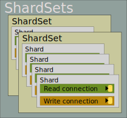

# ShardSets

A “shard set” is a collection of databases with essentially identical schemas, each of which contain a segment of the data. Many — probably most — sharded applications will have only one ShardSet, but this supports contexts where multiple sharding plans exist. For example, User information might be sharded globally by datacenter location, while product availability information might be sharded by subsidiary (ok, this specious example might be better served via microservices; the point is that the framework does not preclude multiple ShardSets if you need them).

The root injectable service is a [ShardSets](/api/ArgentSea.ShardSetsBase-2.html) object, which is merely a collection of `ShardSet` instances.

## The ShardSets Class Hierarchy

The [ShardSets](/api/ArgentSea.ShardSets-2.html) collection is the root of an object hierarchy. The child objects in the hierarchy are implemented as nested classes. This simplifies the implementation, but can also make declarations somewhat verbose.



### Nested classes

* `ShardSets` - the root collection, which provides access to any of the various sharding schemas.
* `ShardSets.ShardSet` - a collection of servers which have the same schema and different segments of data.
* `ShardSets.ShardInstance` - a shard (single data store) with one segment of data. Includes (optionally) separate read and write connections.
* `ShardSets.DataConnection` - A database connection to a shard.

## Accessing the ShardSets

In .NET Core, the ShardSets collection is an injectable service. The instructions in the [Configuration](../configuration/configuration.md) section can help you with setup. You can reference any ShardSet by name (i.e. a string key), which is also defined during configuration. Note that the key name is case/accent/kana sensitive; it must exactly match the value used in your configuration.

Because it is unlikely that you would need to access more than one ShardSet in the same data access class, your class-level variable should capture only the relevant ShardSet. You can access a ShardSet by name (i.e. a string key value):

## [SQL Server](#tab/tabid-sql)

```csharp
    public class SubscriberStore
    {
        private readonly SqlShardSets<string>.ShardSet _shardSet;
        private readonly ILogger<SubscriberStore> _logger;

        public SubscriberStore(SqlShardSets<string> shardSets, ILogger<SubscriberStore> logger)
        {
            _shardSet = shardSets["Subscribers"];
            _logger = logger;
        }

```

## [PostgreSQL](#tab/tabid-pg)

```csharp
public class SubscriberStore
{
    private readonly PgShardSets<string>.ShardSet _shardSet;
    private readonly ILogger<SubscriberStore> _logger;

    public SubscriberStore(PgShardSets<string> shardSets, ILogger<SubscriberStore> logger)
    {
        _shardSet = shardSets["Subscribers"];
        _logger = logger;
    }
}
```

***

## Querying a ShardSet

There are two types of ShardSet queries:

* *Queries on a particular shard* - usually to obtain a specific record, like when you have a ShardKey.
* *Queries across all shards* - when you need a combined list or when don’t know the specific shard(s) to search.

### Accessing a Shard

Access any shard in the ShardSet collection using a shardId key value, just like you would with any other collection. The ShardId value often comes from the ShardId property of a `ShardKey` or `ShardChild`; for convenience, you can simply provide the `ShardKey` or `ShardChild` object instead.

```csharp
/// all of these are equally valid:
var shard = myShardSet[myShardId];
var shard = myShardSet[myShardKey.ShardId];
var shard = myShardSet[myShardKey];
var shard = myShardSet[myShardChild];
```

If you have implemented a solution using identity ranges, just call your custom resolver to get the shard index.

### The Default Shard

When your data clients need to insert a new record, they need to know which shard within the ShardSet to put it in. If, for example, your shards are segmented by region, your regional clients should “default” to the appropriate shard when creating new records. This is configured by the `DefaultShardId` property in your ShardSet configuration.

The default shard works exactly like any other shard, except that you do not need to specify a collection key; instead you can get it from the `DefaultShard` property.

```csharp
var shard = myShardSet.DefaultShard;
```

### Shard Connections

Each [shard](/api/ArgentSea.ShardSetsBase-2.ShardInstance.html) has two data connections, exposed as `Read` property and a `Write` property. The `Read` and `Write` connection properties correspond to the read and write connections defined in your connection [configuration](../configuration/configuration.md). If you have both connections defined in your configuration, then the query will execute on the corresponding read or write connection; if only Read or Write is configured, it doesn’t matter which you use since they will both have the same connection.

## [SQL Server](#tab/tabid-sql)

```csharp
public async Task<Subscriber> GetSubscriber(ShardKey<byte, int> subscriberKey, CancellationToken cancellation)
{
    var prms = new QueryParameterCollection()
        .AddSqlIntInputParameter("@SubId", subscriberKey.RecordId);
    return await _shardSet[subscriberKey].Read.MapOutputAsync<Subscriber>(Queries.GetSubscriber, prms, cancellation);
}
```

## [PostgreSQL](#tab/tabid-pg)

```csharp
public async Task<Subscriber> GetSubscriber(ShardKey<short, int> subscriberKey, CancellationToken cancellation)
{
    var prms = new QueryParameterCollection()
        .AddPgIntegerInputParameter("SubId", subscriberKey.RecordId);
    return await _shardSet[subscriberKey].Read.MapOutputAsync<Subscriber>(Queries.GetSubscriber, prms, cancellation);
}
```

***

Several database implementations — such as *SQL Server Availability Groups* or *AWS Aurora PostgreSQL* to name a couple of examples — enable a master server to handle both reads and writes and separate clone instances that can handle read-only traffic. Most applications have a greater percentage of reads than writes, so this is a great way to scale-out database access. However, there are two issues of concern:

* ArgentSea has *no idea* which queries update data and which are read-only, so it is left to the application developer to designate this by selecting  the appropriate connection property (Read or Write).
* There is often some latency between the time that data is saved and when it is available from the read instance. This temporary data inconsistency can cause problems or confusion due to missing data.

There are several architectural solutions to the latency-driven data inconsistency problem, such as intelligent caching, client observable collections, delayed retries, and retries on the Write connection. Due to the variations in environments, optimal solutions, and the challenge of simple determining when a missing record is really expected, ArgentSea does not attempt an automatic retry on the Write connection.

To implement your own latency handling, you can easily implement an automatic retry using the Write connection after an unexpectedly missing record on the Read connection. In this example method we retrieve data by key value, so a missing record is unexpected and might be due to replication latency. The code assumes that the subscriber key has the “required” attribute set so that the Mapper returns a null object if the key is null. The resolution is to simply retry on the Write connection.

```csharp
    var sub = await _shardSet[subscriberKey].Read.MapReaderAsync<Subscriber>(Queries.GetSubscriber, prms, cancellation);
    // add automatic retry on write connection if subscriber is not found.
    if (sub is null)
    {
        // consider logging the retry on the write connection
        var sub = await _shardSet[subscriberKey].Write.MapReaderAsync<Subscriber>(Queries.GetSubscriber, prms, cancellation);
    }
    return sub;
}

```

> [!TIP]
> Even if you are not using a scale-out strategy today, it would be a good idea to use the `Read` and `Write` properties as if you were. This would make a future migration to separate read and write instances a little easier.  
> You might also consider using different database schemas for read-only and write-capable stored procedures. This helps underline the importance of separating read-only activity to your data developers. And testing may be easier if each connection’s permissions is limited to the appropriate schema.

### Shard Query Methods

There are several query methods, described briefly below and in more detail in the [querying](../querying/querying.md) tutorial. The arguments for these query methods are described in the next section.

#### *RunAsync*

Executes a stored procedure or SQL statement without returning a result — other than an Exception if it is not successful. Presumably, this method would only be called on the Write connection but nothing prevents running a query on the Read connection.

This method also supports running a *Batch*, which is a set of statements which run within the same transaction. Batches on ShardSets do not return results, but batches on databases or shard instances can.

#### *ReturnValueAsync*

Executes a query and returns the value (string, number, etc.) of either the return result, output parameter, or first-row column. The result can also be a ShardKey or ShardChild.

This method might be useful to lookup a single value from the shard rather than an entire record. Its principle and essential role, however, is to enable the return of inserted keys when identity columns are used.

This method is available on individual shards, but not across the ShardSet.

#### *ListAsync*

Executes a query and returns a list containing a Model object, one entry for each record in the result set.

The objects are created using Mapping attributes. If the Model object does not have attributes, you can create a List using QueryAsync with a custom handler.

This method is available on both individual shards and the entire ShardSet. Results across ShardSets are combined into a single list.

#### *QueryAsync*, *QueryFirstAsync*, and *QueryAllAsync*

Executes a query and returns a (potentially complex) result object from output parameters and/or result sets. The method can create an arbitrary result (List, Dictionary, Model, etc.) via a custom delegate that constructs the response.

#### *MapOutputAsync*, *MapOutputFirstAsync*, and*MapOutputAllAsync*

Uses the Mapper to build a result using output parameters. The Mapper can use DataReader results to build list properties. MapOutputAsync is found on individual shards; MapOutputFirstAsync and MapOutputAllAsync are on ShardSets and return the first non-null result, or a list of all non-null results, respectively.

#### *MapReaderAsync*, *MapReaderFirstAsync*, and *MapReaderAllAsync*

Also uses the Mapper to build a results, but does so through a single-row DataReader result, rather than output parameters. List properties of the object result can also be populated through additional result sets.

> [!NOTE]
> Parallelized queries across a ShardSet use the Read connection. Writes should be managed on individual shards.

### Arguments

#### Query (required)

The stored procedure or SQL statement to run.

#### Parameters (required)

In most cases this should be a [QueryParametersCollection](/api/ArgentSea.QueryParameterCollection.html) object. Technically, this argument can be any parameter collection, but the collections provided by ADO.NET are problematic: the DbParameterCollection is abstract, while the provider implementations (SqlParameterCollection and NpgsqlParameterCollection) can only be created by existing command objects.

#### shardParameterOrdinal (optional)

This parameter allows you to set a parameter to current ShardId value.

For example, you might want to return a list of related records that do not exist on the current shard, but the database itself does not know its own shard number. Or perhaps the database *does* know its ShardId and, because mixing up ShardIds in your configuration would be catastrophic, you want to validate that the expected ShardId on the connection corresponds to the ShardId of the database (a practice that I follow).

If set the argument to a value of zero or higher, ArgentSea will assign parameter at that (zero-based) index the value of the connection’s ShardId. If set to -1, no parameter will be assign a ShardId value.

#### cancellationToken

The cancellation token is used to cancel the query on all threads. Typically, you would pass the cancellation token from your MVC web method.

#### resultHandler (optional)

The QueryAsync method requires a method that knows how to convert the data results (output parameters and/or DataReader results) into an object instance. The result could be a Model, List, Dictionary, etc.

The handler must have a method signature corresponding to the [QueryResultModelHandler](/api/ArgentSea.QueryResultModelHandler-3.html) delegate.

Because the ArgentSea Mapper includes method signature that can act as a [QueryResultModelHandler](/api/ArgentSea.QueryResultModelHandler-3.html) delegate. The query methods that do not require this parameter assume the Mapper is being used. The generic result type must implement *MapTo* property attributes for the Mapper to function.

#### TopOne

Set this argument `True` if only one result is expected. For example, suppose you are searching a ShardSet for a User account matching a login. There should only be one match, so as soon as the first match is obtained you want to return the result object and abandon any remaining queries.

Technically, when this argument is True, ArgentSea checks each shard query to see if it has a non-null Model result. If it finds one, it fires the cancellation token for any shard connection that has not yet completed, and returns the result.

Of course, if the search conditions are not unique (which is difficult to enforce with sharded data), any duplicate result(s) will be lost.