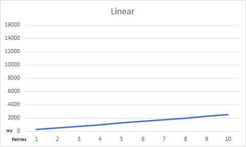
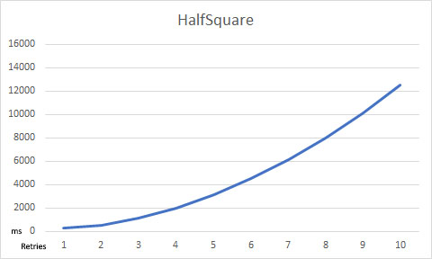
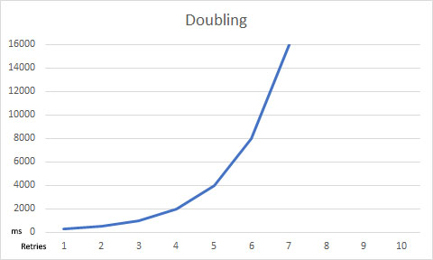

# Configuration Deep-Dive

## Introduction

ArgentSea fully leverages the configuration architecture of .NET core/.NET standard. If this architecture is new to you, it essentially consists of two parts:

* A configuration dictionary, which can be loaded from multiple sources, one of which is a file called *appsettings.json*
* An “options” architecture, which casts the configuration entries into a strongly-typed configuration object.

One of the key improvements of the configuration architecture in .NET standard is the dictionary architecture, which allows entries to be loaded from multiple sources. So, for example, you might load the account names from an *appsettings.json* configuration file, the passwords from a usersecrets.json file (or Key Vault), and the server names from environment variables. Properly managed, this can make deployments both easier and more secure.

## ArgentSea Database Connections

There are two types of database connections in ArgentSea:

* __A *database connection*__ - a data set which is hosted by a single database
* __A *shard set*__  - a single data set spread over multiple database connections

ArgentSea configuration supports any number of *database connections* and any number of *shard sets*. And of course each *shard set* can have many database connections.

### Limiting Redundancy Across Multiple Connection Definitions

This creates a potentially large number of database connections. Many of these will likely have similar connection information. In many scenarios, all of the connections in a shard set would use the same login information. Likewise, in a given datacenter environment it only makes sense that all connections use the same resiliency strategy.

To manage this redundancy, the ArgentSea configuration data is broken into four parts:

* Login credential information, which can be referenced by any connection.
* Data resilience strategies, any of which can be referenced by any connection.
* Database connection information
* Shard set connection information

#### Credentials

If you are using json configuration files to manage your configuration, the credentials section in your configuration might look like this:

````json
  "Credentials": [
    {
      "SecurityKey": "0",
      "UserName": "webuser",
      "Password": "123456"
    },
    {
      "SecurityKey": "1",
      "WindowsAuth": true,
    },
    {
      "SecurityKey": "2",
      "UserName": "admin",
      "Password": "7890"
    }
  ]
````

If you prefer to set the properties of an Options class directly, you can use the ArgentSea.DataSecurityOptions class.

You should put this configuration section into a secure location. In a development environment, you should consider using the *UserSecrets* functionality, which prevents this information from being checked into your source code repository. In other environments, you might consider using you should use AWS Secrets Manager, Azure Key Vault, or something similar.

The *SecurityKey* property must be unique and exactly match the security string key that you specify on your connection (i.e. both must have the same casing).

#### Resilience Strategies

Resilience strategies define how ArgentSea recovers from unexpected failures, usually through some combination of retry logic and circuit breaking. Because one typically requires only a few resilience strategies across datacenters (perhaps one for local connections and another for across the WAN), to reduce redundancy we use the same keyed approach as for security.

A general Resilience Strategy is implicit. If a connection does not specify a Resilience Strategy, this
default one will be used. If it is defined, the corresponding connection(s) must specify the key (again, casing matters).

An example resiliency configuration section might look like this:

````json
  "ResilienceStrategies": [
    {
      "DataResilienceKey": "local",
      "RetryCount": "6",
      "RetryInterval": "150",
      "RetryLengthening": "Linear",
      "CircuitBreakerFailureCount": "10",
      "CircuitBreakerTestInterval": "5000"
    },
    {
      "DataResilienceKey": "remote",
      "RetryCount": "6",
      "RetryInterval": "250",
      "RetryLengthening": "Fibonacci",
      "CircuitBreakerFailureCount": "20",
      "CircuitBreakerTestInterval": "5000"
    }
````

##### Retries

Not that retries only occur on errors that are defined as *transient*.
A permissions error or invalid object reference would be pointless to retry.
(The list of errors defined as *transient* is in the provider-specific implementation
of IDataProviderServiceFactory. You can view this in the source code).

The `RetryCount` setting determines how many times the connection retries before aborting
and raising an error back to the caller.
The `RetryInterval` determines the length of time (in milliseconds) between retries.
The `RetryLengthening` value can add an additional pause between subsequent retries.

One might presume that if the system encounters a transient error, it should retry quickly.
Then, if the retry is not successful, it should wait a bit longer for the error to clear before
retrying again. The `RetryLengthening1 value is what determines how much longer it will pause
on subsequent retries before giving up.

The `RetryLengthening` values are:

* __Linear__ - each retry is the same duration as specified in `RetryInterval`
* __Fibonacci__ - The first retry is at `RetryInterval`, each subsequent retry interval pauses for the duration of the previous two combined.
* __HalfSquare__ - the retry count number is squared, then divided by two, then multiplied by `RetryInterval`
* __Squaring__ - each retry attempt doubles the duration of the previous one.

You can visualize the impact of `RetryLengthening` with these charts:








If a Resilience Strategy is not defined, ArgentSea will use a default strategy. Currently, this a is `RetryCount` of 6, `RetryInterval` of 250 milliseconds, and a
`RetryLengthening` of Fibonacci. With these values, the default resilience strategy would take a total of five seconds to finally fail.

Note that a high `RetryCount` could create a very long delay before a connection is allowed to ultimately fail.

##### Circuit Breaking

When a database connection is unavailable, this can cause serious downstream problems. Processes may pile-on further requests even while earlier requests are simply waiting
to time out. As this continues, the queue of backlogged requests becomes so large that the caller itself can manage no more. This bottleneck can block other systems too. What started as a broken connection to a single database eventually becomes fatal to the calling system too!

This is the reason to add a “circuit breaker” — a fail-fast mechanism to ensure that callers do not wait needlessly for queued connections that are unlikely to succeed, and which are blocking other processes too.

When the circuit breaker is tripped, subsequent connections will fail *immediately*. This prevents queuing, bottleneck blocking, and downstream failures. While tripped, the circuit breaker will periodically allow a single transaction to proceed; if it successful the circuit breaker is reopened. In this way, a system restoration will automatically close the circuit breaker too so that connections can resume.

The `CircuitBreakerFailureCount` value determines how many sequential failures will trigger the circuit breaker. The `CircuitBreakerTestInterval` value determines
how often (in milliseconds) the circuit breaker will allow a single transaction through.

### Database Connections

The database configuration architecure allow any number of database connections. Each connection is identified by a key, which you also use to request the connection in your code.

The connection information is specific to the database provider.

## [SQL Server](#tab/tabid-sql)

### SQL Server Database Connections

For SQL Server, the entire set of attributes would look like this:

````json

"SqlDbConnections": [
  {
    "DatabaseKey": "MyDb",
    "DataConnection": {
      "SecurityKey": "0",
      "DataResilienceKey": "remote",
      "ApplicationIntent": "ReadWrite",
      "ApplicationName": "MyWebApp",
      "ConnectRetryCount": 0,
      "ConnectRetryInterval": 0,
      "ConnectTimeout": 2,
      "CurrentLanguage": "english",
      "DataSource": "localhost",
      "Encrypt": false,
      "FailoverPartner": "",
      "InitialCatalog": "MyDb",
      "LoadBalanceTimeout": 0,
      "MaxPoolSize": 100,
      "MinPoolSize": 0,
      "MultipleActiveResultSets": false,
      "MultiSubnetFailover": true,
      "PacketSize": 8000,
      "PersistSecurityInfo": false,
      "Pooling": true,
      "Replication": false,
      "TrustServerCertificate": true,
      "TypeSystemVersion": "Latest",
      "WorkstationID": ""
    }
  }
]
````

You do *not* need include all of these attributes in your connection! Any value not included in your configuration will be set to the provider default — except as described in the next paragraphs.

The `ConnectRetryCount`, `ConnectRetryInterval` values default to 0 because the ArgentSea retry logic duplicates this functionality. If you prefer to use the SqlClient retry functionality instead, set these to their desired values and specify a `ResilienceStrategy` with no retries. If you use both connection retries *and* ArgentSea retries, no harm will come, other than a lot of retries.

The other exception to the provider default values is the `ConnectTimeout` value. The provider default is 15 seconds, but with the ArgentSea’s retry logic, this could create
unnecessarily long connection timeouts. The ArgentSea default is 2 seconds because datacenter connections are easily resolved in that time unless something is wrong.
If you have a WAN or high-latency connection (or are using ConnectRetryCount), you should consider increasing this value.

If you accept the defaults, the only required parameter values are:

````json
"SqlDbConnections": [
  {
    "DatabaseKey": 1,
    "DataConnection ": {
      "SecurityKey": "2",
      "DataResilienceKey": "remote",
      "DataSource": "localhost",
      "InitialCatalog": "MyDb",
    }
  }
]
````

## [PostgreSQL](#tab/tabid-pg)

### PostgreSQL Database Connections

For SQL Server, the entire set of attributes would look like this:

````json
"PgDbConnections": [
  {
    "DatabaseKey": "MyDB",
    "DataConnection": {
      "SecurityKey": "MyCredentials",
      "ResilienceKey": "local",
      "ApplicationName": "MyWebApp",
      "AutoPrepareMinUsages": 5,
      "CheckCertificateRevocation": false,
      "ClientEncoding": "UTF8",
      "CommandTimeout": 15,
      "ConnectionIdleLifetime": 300,
      "ConnectionPruningInterval": 10,
      "ConvertInfinityDateTime": false,
      "Database": "MyDB",
      "Encoding": "UTF8",
      "Enlist": true,
      "Host": "10.10.1.22",
      "IncludeRealm": false,
      "InternalCommandTimeout": -1,
      "KeepAlive": 0,
      "KerberosServiceName": "postgres",
      "MaxAutoPrepare": 0,
      "MaxPoolSize": 100,
      "MinPoolSize": 1,
      "NoResetOnClose": false,
      "PersistSecurityInfo": true,
      "Pooling": true,
      "Port": 5432,
      "ReadBufferSize": 8192,
      "SearchPath": "",
      "ServerCompatibilityMode": "Redshift",
      "SocketReceiveBufferSize": 8192,
      "SocketSendBufferSize": 8192,
      "SslMode": "Disable",
      "TcpKeepAliveInterval": 0,
      "TcpKeepAliveTime": 0,
      "Timeout": 2,
      "TrustServerCertificate": false,
      "UsePerfCounters": false,
      "UseSslStream": false,
      "WriteBufferSize": 8192
    }
  }
]
````

You do *not* need include all of these attributes in your connection! Any value not included in your configuration will be set to the provider default — except as described in the next paragraph.

The principal change to the provider default values is the `ConnectTimeout` value. The provider default is 15 seconds, but with the ArgentSea’s retry logic, this could create
unnecessarily long connection timeouts. The ArgentSea default is 2 seconds because datacenter connections are easily resolved in that time unless something is wrong.
If you have a WAN or high-latency connection (or are using ConnectRetryCount), you should consider increasing this value.

If you accept the defaults and are running on the default port (5432), the only required parameter values are:

````json
"PgDbConnections": [
  {
    "DatabaseKey": "MyDB",
    "DataConnection": {
      "SecurityKey": "MyCredentials",
      "Host": "localhost",
      "Database": "MyDb",
    }
  }
]

````

***

## Shard Set Connections

A shard set represents a single set of data  that is spread among multiple database servers. This structure is common for high-performance data access, since it is usually more cost effective and predictably scalable to have multiple smaller database servers than to build one massive server. Global applications might try to improve performance for their global users by distributing shards in datacenters around the globe. The ArgentSea data access components allow you to query across multiple servers or a find specific record on its corresponding host server.

From a configuration perspective, sharded data introduces three concerns:

* Sharded data requires a larger number of database connections to manage.
* Scaled out data often uses different connections for read operations and write operations.
* Because sharded records often need to refer to related records hosted in other shards, the shard identifier become part of the record key.

### Managing Database Connections

Sharded data sets may run to hundreds of servers. ArgentSea manages any number of distinct shard sets and any number of connections in each shard set.

You could have a distinct shard set for, say, all of your subscriber information and a separate shard set for all of your operational data. You define the shard set name in your configuration; when you query a shard set, you simply specify the shard set name.

### Distinct Read and Write Endpoints

If you are scaling-out your data access by sharding your data, you are likely also scaling-out by separating read activity from write operations. Examples of this includes SQL Availability Groups, RDS Read Replicas, Azure SQL geo-replication, Aurora reader endpoints, etc.

ArgentSea shard sets have both read connections and write connections. Only one of these *must* be defined. If only one is defined, it will be used for both.

Complicating this is the replication latency between the write/read servers. A read immediately following a write might fail because the expected data has not yet been copied to the read server.

To accommodate replication latency when an expected read-only result is not retrieved, ArgentSea will immediately retry the query on the read-write connection under the following conditions:

* The query arguments indicate that it is read-only data fetch.
* The read connection is different than the write connection.
* The query handler returns a null object (i.e. a parameter attribute is marked *required* but the database value is (db) null or a custom handler returns null).

### The Shard Identifier Type

Each database in a shard set has a shard identifier *(shardId)*. The shardId is used in combination with the record key to uniquely identify a record. In other words, records in the shard set are identified with a sort of virtual compound key, consisting of the shard identifier and the record key.

> [!INFORMATION]
> Records within a shard set are uniquely identified with a sort of virtual compound key — a ShardKey — consisting of the shardId and the record identifier.

The data type of the ShardId is important because a record in a data shard may refer to records in *other* shards. Persisting the remote shard reference means saving the shard identifier too.

In other words, the ShardId *type* is used in configuration, throughout your code, in the database, and across all shard sets.

> [!WARNING]
> Once established, the ShardId *type* cannot be easily changed.

Technically, the ShardId can be one of the following types: byte, char, DateTime, DateTimeOffset, decimal, double, float, Guid, int, long, sbyte, short, string, TimeSpan, uint, ulong, or ushort. Practically, realistic candidates are much fewer. Avoid types without a corresponding SQL type and unnecessarily large data sizes.

Essentially, this leaves *byte*, *short*, *char* as efficient choices; and *int* or *string* as choices if your ShardId needs to integrate with some external system with previously defined data.

Your configuration must also be aware of the nature of this shard key; the ShardId value in your json configuration file must be cast to your ShardId type.

## ShardSet JSON

## [SQL Server](#tab/tabid-sql)

For SQL Server, a simple configuration would look like this (assuming that the ShardId type is an integer value):

````json
"SqlShardSets": [
  {
    "ShardSetKey": "Set1",
    "Shards": [
      {
        "ShardId": 0,
        "ReadConnection": {
          "SecurityKey": "0",
          "DataResilienceKey": "local",
          "DataSource": "LocalServer",
          "InitialCatalog": "dbName1"
        },
        "WriteConnection": {
          "SecurityKey": "0",
          "DataResilienceKey": "remote",
          "DataSource": "RemoteServer",
          "InitialCatalog": "dbName1"
        }
      },
      {
        "ShardId": 1,
        "ReadConnection": {
          "SecurityKey": "0",
          "DataResilienceKey": "remote",
          "DataSource": "RemoteServer",
          "InitialCatalog": "dbName2"
        },
        "WriteConnection": {
          "SecurityKey": "0",
          "DataResilienceKey": "local",
          "ApplicationIntent": "ReadWrite",
          "ApplicationName": "MyWebApp",
          "ConnectRetryCount": 0,
          "ConnectRetryInterval": 0,
          "ConnectTimeout": 2,
          "CurrentLanguage": "english",
          "DataSource": "LocalServer",
          "Encrypt": false,
          "FailoverPartner": "",
          "InitialCatalog": "dbName2",
          "LoadBalanceTimeout": 0,
          "MaxPoolSize": 100,
          "MinPoolSize": 0,
          "MultipleActiveResultSets": false,
          "MultiSubnetFailover": true,
          "PacketSize": 8000,
          "PersistSecurityInfo": false,
          "Pooling": true,
          "Replication": false,
          "TrustServerCertificate": true,
          "TypeSystemVersion": "Latest",
          "WorkstationID": ""
        }
      }
    ]
  }
]
````

## [PostgreSQL](#tab/tabid-pg)

For PostgreSQL, a simple configuration would look like this (assuming that the ShardId type is an integer value):

````json
"SqlShardSets": [
  {
    "ShardSetKey": "Set1",
    "Shards": [
      {
        "ShardId": 0,
        "ReadConnection": {
          "SecurityKey": "0",
          "DataResilienceKey": "local",
          "Host": "LocalServer",
          "Database": "dbName1",
        },
        "WriteConnection": {
          "SecurityKey": "0",
          "DataResilienceKey": "remote",
          "Host": "RemoteServer",
          "Database": "dbName1",
        }
      },
      {
        "ShardId": 1,
        "ReadConnection": {
          "SecurityKey": "0",
          "DataResilienceKey": "remote",
          "Host": "RemoteServer",
          "Database": "dbName2",
        },
        "WriteConnection": {
          "SecurityKey": "0",
          "DataResilienceKey": "local",
          "ApplicationName": "MyWebApp",
          "AutoPrepareMinUsages": 5,
          "CheckCertificateRevocation": false,
          "ClientEncoding": "UTF8",
          "CommandTimeout": 15,
          "ConnectionIdleLifetime": 300,
          "ConnectionPruningInterval": 10,
          "ConvertInfinityDateTime": false,
          "Database": "dbName2",
          "Encoding": "UTF8",
          "Enlist": true,
          "Host": "LocalServer",
          "IncludeRealm": false,
          "InternalCommandTimeout": -1,
          "KeepAlive": 0,
          "KerberosServiceName": "postgres",
          "MaxAutoPrepare": 0,
          "MaxPoolSize": 100,
          "MinPoolSize": 1,
          "NoResetOnClose": false,
          "PersistSecurityInfo": true,
          "Pooling": true,
          "Port": 5432,
          "ReadBufferSize": 8192,
          "SearchPath": "",
          "ServerCompatibilityMode": "Redshift",
          "SocketReceiveBufferSize": 8192,
          "SocketSendBufferSize": 8192,
          "SslMode": "Disable",
          "TcpKeepAliveInterval": 0,
          "TcpKeepAliveTime": 0,
          "Timeout": 2,
          "TrustServerCertificate": false,
          "UsePerfCounters": false,
          "UseSslStream": false,
          "WriteBufferSize": 8192
        }
      }
    ]
  }
]
````

***

The configuration file can repeat the ShardSet section (the object with ShardSetKey and Shards entries) for each shard set. Likewise, the entries in the Shards array can repeat for every data shard in the shard set. As illustrated by Shard 1’s Write Connection, any connection can include a any number of provider-specific connection attributes.

## Loading the Configuration

ArgentSea uses the built-in Options configuration and dependency injection architecture in .NET Core. The complexity of turning a JSON configuration file into a connection object is as simple as adding the `services.AddSqlServices<TShard>(Configuration)` extension method to the `ConfigureServices` method in your `Startup` class.

## [SQL Server](#tab/tabid-sql)

This example assumes that your shardId type is *byte*. If you use any other type, change the generic parameter.

If you use ArgentSea database connections *without* sharding, simply remove the generic declaration altogether (i.e. `services.AddPgServices(Configuration);` only).

````C#
        public void ConfigureServices(IServiceCollection services)
        {
            ...
            // add your injectable logging provider
            services.AddLogging();
            // add the ArgentSea SQL database connections (shardId type: byte)
            services.AddSqlServices<byte>(Configuration);
            // now add your custom data classes, which use the data components
            services.AddSingleton<MyDataStore>();
            ...
            services.AddMvc();
            ...
        }

````

## [PostgreSQL](#tab/tabid-pg)

This example assumes that your shardId type is *byte*. If you use any other type, change the generic parameter.

If you use ArgentSea database connections *without* sharding, simply remove the generic declaration altogether (i.e. `services.AddPgServices(Configuration);` only).

````C#
        public void ConfigureServices(IServiceCollection services)
        {
            ...
            // add your injectable logging provider
            services.AddLogging();
            // add the ArgentSea SQL database connections (shardId type: byte)
            services.AddPgServices<byte>(Configuration);
            // now add your custom data classes, which use the data components
            services.AddSingleton<MyDataStore>();
            ...
            services.AddMvc();
            ...
        }
        public IConfiguration Configuration { get; }

````

***

This code references a `Configuration` property. It is common practice to obtain the configuration object from the constructor of the `Startup` class, then use this to set the `Configuration` property.

### Simplified Data Connections

In .NET Core, any data repository class can use the ArgentSea data access component by adding and argument to its constructor.

if you any experience in .NET Core, requesting the database connection in any data access class is straightforward:

## [SQL Server](#tab/tabid-sql)

```C#

        public MyDataAccessStore(SqlDatabases dbs, ILogger<MyDataAccessStore> logger)
        {
          ...

```

## [PostgreSQL](#tab/tabid-pg)

```C#

        public MyDataAccessStore(PgDatabases dbs, ILogger<MyDataAccessStore> logger)
        {
          ...

```

***

The injected data access component allows the class to access *any* connection, which means that you would need to specify the connection name. In most cases, however, the class will only access a *single* data source.

To simplify the data access code, you can instead store only the relevant connection instance:

## [SQL Server](#tab/tabid-sql)

```C#
        private readonly SqlDatabases.DataConnection _data;

        public MyDataAccessStore(SqlDatabases dbs, ILogger<MyDataAccessStore> logger)
        {
            ...
            _data = dbs.DbConnections["MyConnectionName"];
          ...
```

Subsequent calls to the SQL database can be on methods directly on the `_data` object.

## [PostgreSQL](#tab/tabid-pg)

```C#
        private readonly PgDatabases.DataConnection _data;

        public MyDataAccessStore(PgDatabases dbs, ILogger<MyDataAccessStore> logger)
        {
            ...
            _data = dbs.DbConnections["MyConnectionName"];
          ...
```

Subsequent calls to the SQL database can be on methods directly on the `_data` object.

***

The flexibility of the `ShardSets` object stands in more need of this simplification. Using the ArgentSea components requires that the generic *ShardId* type (which can never change) is declared redundantly. You can simplify this is two ways:

* Use the `using` statement to alias the ShardSet declaration.
* Declare a internal class which inherits from ShardSet

To simplify calling a ShardSet *within a single file*, simply add:

## [SQL Server](#tab/tabid-sql)

```C#
using ShardSets = ArgentSea.Sql.SqlShardSets<byte>;
// and/or
using ShardSet = ArgentSea.Sql.SqlShardSets<byte>.ShardDataSet;
```

Again, the assumes a ShardId type of *byte*; replace this as appropriate.

## [PostgreSQL](#tab/tabid-pg)

```C#
using ShardSets = ArgentSea.Pg.PgShardSets<byte>;
// and/or
using ShardSet = ArgentSea.Pg.PgShardSets<byte>.ShardDataSet;
```

Again, the assumes a ShardId type of *byte*; replace this as appropriate.

***

By creating a local class that inherits from then generic class, you can simplify the shard set reference throughout your project.

## [SQL Server](#tab/tabid-sql)

```C#
    public class ShardSets : SqlShardSets<byte>
    {
        public ShardSets(
            IOptions<SqlShardConnectionOptions<byte>> configOptions,
            IOptions<DataSecurityOptions> securityOptions,
            IOptions<DataResilienceOptions> resilienceStrategiesOptions,
            ILogger<ShardSets> logger
        ) : base(configOptions, securityOptions, resilienceStrategiesOptions, logger)
        {
            //
        }
    }

```

## [PostgreSQL](#tab/tabid-pg)

```C#
    public class ShardSets : PgShardSets<byte>
    {
        public ShardSets(
            IOptions<SqlShardConnectionOptions<byte>> configOptions,
            IOptions<DataSecurityOptions> securityOptions,
            IOptions<DataResilienceOptions> resilienceStrategiesOptions,
            ILogger<ShardSets> logger
        ) : base(configOptions, securityOptions, resilienceStrategiesOptions, logger)
        {
            //
        }
    }

```

***

This approach will be helpful in reducing the number of times the generic *shardId* type must be specified in project.